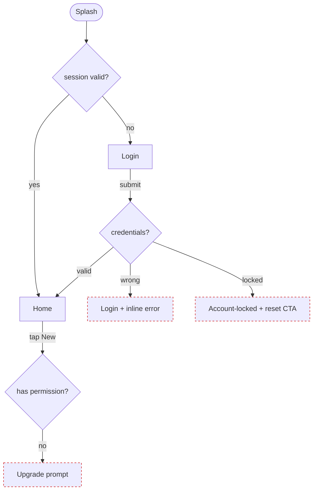

## 1 · Frame the problem (kill the wishlist here)

Fill this in literally — every blank, no hedging:
```
PROBLEM     <who> can't <do what> because <the real obstacle>; today they <current workaround>.
EVIDENCE    the signal this is real — support tickets / an interview quote / a funnel drop-off / an analytics number.
JOB (JTBD)  When <situation>, I want to <motivation>, so I can <expected outcome>.
            Switch forces: PUSH (pain of today) · PULL (draw of new) · ANXIETY (what scares them) · HABIT (inertia).
SCOPE       IN: <the 1–3 things this release does>   OUT: <everything tempting you're NOT doing>
SUCCESS     North-star: <metric> ; guardrail: <metric that must NOT regress> ; measured by <instrument> within <window>.
ASSUMPTION  Riskiest belief that, if false, sinks this: <…>. How we'd know early: <…>.
```
Filled (the running order/refund case — no blanks, no hedging; this is the bar):
```
PROBLEM     A buyer who got a defective item can't start a refund without emailing support (no self-serve path); today they wait 2–3 days for a reply.
EVIDENCE    refund tickets = 28% of support volume (Zendesk tag `refund`, last 90d); median first-reply 31h.
JOB         When my order arrives damaged, I want to start a refund myself in under a minute, so I can stop worrying about my money.
            PUSH slow email loop · PULL instant self-serve · ANXIETY "will I actually get the money back?" · HABIT just email support.
SCOPE       IN: self-serve refund on delivered orders inside the 30-day window.  OUT: partial refunds, exchanges, shipping refunds, live chat.
SUCCESS     North-star: % refunds self-served (target 60% in 60d) ; guardrail: refund-fraud rate must not rise >0.2pp ; measured by `refund_requested` event + finance ledger within 8 weeks.
ASSUMPTION  Riskiest: buyers trust a self-serve refund as much as a human reply. Know early: confirm-step drop-off in the funnel + a 5-user test.
```
**Success metrics go UP FRONT, never bolted on at the end.** Pick the framework by job:
- Product feature → **HEART** (Happiness, Engagement, Adoption, Retention, Task-success). Pick 1–2, not all five.
- Funnel / acquisition → **AARRR** pirate metrics → that's `marketing-conversion`'s turf; coordinate.
- Each metric needs: **name · instrument (event/query) · baseline · target.** "Improve engagement" is not a metric.

## 2 · Map users & jobs (lightweight, evidence-grounded — NOT persona theatre)

Write an **actor card**, named by the user's *job*, not a fictional human with a stock photo:
```
ACTOR    "first-time refund requester"   ← good.   "Sarah, 32, marketing manager, loves lattes"   ← BANNED.
CONTEXT  device / where / when / the constraint that shapes the UI (one-handed, in transit, low bandwidth, rushed).
GOAL     the JTBD this actor carries into the product.
PAIN     what blocks them today — verbatim quote if you have one.
KNOWS    domain literacy 1–5 → sets vocabulary and how much you must explain on-screen.
TRUST    skepticism 1–5 → how much proof/reassurance the flow must carry before the ask.
```
**Hard rule:** delete any attribute that doesn't change a design decision. If "age 32" changes no screen, it's theatre — cut it. 2–4 actors max; if you have seven, you have no plan.

**Journey map** (use when the experience spans time/channels, e.g. onboarding, a purchase, a support resolution). One row per phase:

| Phase | Doing (action) | Thinking (question in their head) | Feeling (-2…+2) | Opportunity / drop-off risk |
|---|---|---|---|---|
| Discover | lands from ad | "is this legit?" | -1 | proof above fold; load < 2s |
| Evaluate | compares plans | "which tier?" | 0 | comparison table, default pick |
| Commit | enters payment | "is my card safe?" | -1 | trust marks, error-tolerant form |

The low-feeling, high-question rows are where flows and states earn their keep.

## 3 · User flows (happy path first, then everything that breaks)

A flow you can actually type. **Legend** — keep it at the top of every flow:
```
[Screen]            a screen / page / view (give it the name you'll use everywhere downstream)
( action )          a user action or system event on a transition
⟨ decision? ⟩       a branch — list EVERY outcome, not just the success one
──▶                 transition (label it with the action)
✗ ──▶               an error / failure transition
⟡ entry:            an entry point INTO the flow (cold open, deep link, push, back, refresh, shared URL)
⊘                   a dead end — if you draw one, that's a bug to fix, not a destination
```
Example — login + first action, with the branches a wishlist would have skipped:
```
⟡ entry: cold open ─┐
⟡ entry: deep link ─┼──▶ [Splash] ──▶ ⟨ session valid? ⟩
⟡ entry: push tap ──┘                   │ yes ──▶ [Home]
                                        │ no  ──▶ [Login]
[Login] ──(submit)──▶ ⟨ credentials? ⟩
                        │ valid    ──▶ [Home]
                        │ wrong    ✗──▶ [Login + inline error, field keeps value]   (stay, retry)
                        │ locked   ✗──▶ [Account-locked + "reset password" CTA]
                        │ offline  ✗──▶ [Login + "no connection, retry" toast]      (queue, retry)
[Home] ──(tap "New")──▶ ⟨ has permission? ⟩
                          │ yes ──▶ [Create]
                          │ no  ✗──▶ [Upgrade prompt]   ← not a dead end; gives the next step
```
Rules: (a) **map entry points before screens** — most flows are entered mid-stream (a shared link to a detail page, a back-button into a half-filled form). (b) Every `⟨decision⟩` lists *all* outcomes. (c) Every `✗` path resolves to a real screen with a way forward — never `⊘`. (d) Mark the **one** primary path so design knows what to optimize.

## 4 · Information architecture

- **Sitemap** — the screen tree. Group by the user's mental model, **not the org chart, not the database tables** (that's Conway's-law IA and it's banned). Depth over 3 levels for a consumer app is a smell.
- **Navigation model** — pick one and justify: tabs (3–5 top-level, flat, frequent) · drawer/hamburger (many sections, infrequent) · nested/hub-and-spoke (deep catalog) · breadcrumb (hierarchical content). Don't mix two primary models.
- **Content inventory** — one row per content type, so build knows the data shape:

  | Content type | Key fields | Source | Cardinality | Empty when | Sort/filter |
  |---|---|---|---|---|---|
  | Order | id, status, total, items[] | orders API | 0…n per user | new user | by date desc |

- **Labeling** — name things in the **user's words**, validated. "My Stuff" beats "Asset Repository". Same label everywhere it appears (nav → page title → breadcrumb match).
- **Card sort + tree test** — when groupings aren't obvious: run an **open card sort** (users group + name) to derive the IA, then a **tree test** (find an item in the proposed tree) to validate findability. Target ≥ 80% task success; tools: Maze, Optimal Workshop (OptimalSort/Treejack), or paper sticky-notes with 5 users. Don't guess IA for anything with > ~15 destinations.
- **Route / URL table** — IA becomes routes; hand these straight to `frontend-build`:

  | Screen | Route | Params | Auth | Notes |
  |---|---|---|---|---|
  | Order detail | `/orders/:id` | id | required | 404 if not owner |
  | Checkout | `/checkout` | — | required | redirect to `/login?next=/checkout` |

  Routes are nouns/resources, lowercase, hyphenated, stable, and shareable. No verbs in URLs.

## 5 · Wireframe (low-fi FIRST — greyscale, no brand, on purpose)

Decide **layout and hierarchy before anyone picks a color.** Two cheap formats:

**ASCII block** — fast, lives in the doc. Convention: `▢` = image/media, `▭` = input, `[ Btn ]` = action, `≡` = list rows, `——` = divider.
```
┌─────────────────────────────┐
│ ‹  Order #1042         ⋯     │  ← back · title (the screen's name) · overflow
├─────────────────────────────┤
│ ▢  product thumb            │
│    Name of item             │  ← primary content, biggest weight
│    ₩29,000 · Delivered      │
│ ———————————————————————     │
│ ≡  item · item · item       │  ← secondary list
│                             │
│ [   Track package   ]       │  ← ONE primary action (the screen's job)
│   Request refund            │  ← secondary, lower contrast
└─────────────────────────────┘
```

**Throwaway HTML wireframe** — when layout/responsiveness needs real proof. Deliberately ugly so nobody mistakes it for visual design. **This is the one place a system font is correct** (the inverse of the detail-page banned-fonts rule): we *want* it to look unfinished.
```html
<!doctype html><meta name=viewport content="width=device-width,initial-scale=1">
<style>
  :root{font-family:ui-monospace,SFMono-Regular,Menlo,monospace;color:#333}
  *{box-sizing:border-box} body{margin:0;background:#fff}
  .wire{max-width:420px;margin:auto;padding:16px}
  .box{border:1.5px solid #999;background:#f2f2f2;padding:12px;margin:8px 0;border-radius:2px}
  .img{aspect-ratio:16/9;display:grid;place-items:center;color:#aaa;
       background:repeating-linear-gradient(45deg,#eee 0 8px,#e3e3e3 8px 16px)}
  .img::after{content:"image"} .btn{border:1.5px solid #333;text-align:center;padding:12px;font-weight:700}
  .muted{color:#888} h1{font-size:18px;margin:.2em 0} input{width:100%;padding:10px;border:1.5px dashed #999;background:#fafafa}
</style>
<div class=wire>
  <div class=box><span class=muted>‹ back</span> · <b>Order #1042</b></div>
  <div class="box img"></div>
  <div class=box><h1>Item name</h1><div class=muted>₩29,000 · Delivered</div></div>
  <div class="box btn">Track package</div>
  <div class="box muted">Request refund</div>
</div>
```
Open/shoot it (responsive at 390px) with the shared loop instead of reinventing one:
```bash
NODE_PATH=$(npm root -g) node ${CLAUDE_PLUGIN_ROOT}/skills/detail-page/scripts/shoot.js /tmp/wire/order.html /tmp/wire/shots
```
Read the tiles and ask only low-fi questions: is the **one** primary action obvious in greyscale? does hierarchy survive without color? does it hold at 390px? Visual polish is explicitly **not** judged here.

**What every screen must declare** (the 6-slot screen card — fill it for each):
```
PURPOSE   the one job this screen does (one sentence; if you need "and", split the screen)
PRIMARY   the single primary action + where it goes
CONTENT   what data it shows (ties to the content inventory)
STATES    which of empty/loading/error/success/offline/forbidden it can be in (→ step 6)
ENTRY     how users arrive (ties to the flow's ⟡ entries)
EXIT      where they can go next (no dead ends)
```

## 6 · Content design & states (the states ARE the work)

Happy-path-only is the most common slop. Every screen that loads data covers, with **real copy**, not "TODO":

| State | When | What to show |
|---|---|---|
| **Empty (first run)** | no data yet | an invitation + ONE action to create the first item (not a sad blank) |
| **Empty (zero results)** | filter/search returns nothing | what was searched + how to broaden; not the same as first-run empty |
| **Loading** | fetch in flight | skeleton matching final layout (not a centered spinner if > instant) |
| **Partial / slow** | some data, more coming | show what's ready; don't block the whole screen |
| **Error** | request failed | what happened + a retry; never a raw stack trace |
| **Success** | action completed | confirmation + the next step (so it's not a dead end) |
| **Offline** | no connection | what still works + what's queued |
| **Forbidden** | lacks permission | why + how to get access (the upgrade/request path) |

**Microcopy rules** (copy is part of the spec, not an afterthought):
- Button = the **verb of what happens** ("Save changes", "Place order"), and keeps its name through the flow (button "Publish" → toast "Published"). Never "Submit"/"OK" for a meaningful action.
- Errors: state **what happened + how to fix**, no apology, never vague ("Couldn't reach the server — retry" not "Oops! Something went wrong").
- Empty states are an invitation to act, not a tombstone. Specific always beats clever.
- **Forms:** one column; label *above* the field; validate inline **on blur**, not only on submit; show the required format before they're wrong; minimize fields (every field is a tax); smart defaults; group related fields; the primary button repeats the action's name.
- **Progressive disclosure:** show the 80% case; tuck the advanced 20% behind "More options". Don't dump every control at once. But never hide a *required* decision behind disclosure.

## 7 · Spec & acceptance (testable, or it isn't a spec)

**One message per screen — enforce it.** Each screen earns its place by advancing exactly one decision. Name that decision; everything else on the screen serves it or gets cut. The spec lists, per screen: the **one message**, the **one primary action**, its states, its route.

**Screen inventory** — the master table build works from:

| # | Screen | Route | One message | Primary action | States | Data |
|---|---|---|---|---|---|---|
| 1 | Order detail | `/orders/:id` | "here's your order + how to act on it" | Track package | loading/error/success/forbidden | order |

**Acceptance criteria — Given/When/Then (Gherkin), one block per behavior.** A QA must be able to write a test verbatim:
```
Scenario: Refund request on a delivered order
  Given I am the owner of order #1042 in state "Delivered"
  When  I tap "Request refund" and confirm
  Then  the order state becomes "Refund requested"
  And   I see a confirmation with the expected processing window
  And   "Request refund" is replaced by "Cancel request"

Scenario: Refund blocked outside the window
  Given order #1042 was delivered 31 days ago and the window is 30 days
  When  I open the order
  Then  "Request refund" is disabled with the reason shown inline
```
If you can't write the Then as an observable outcome, the requirement is still a wish — sharpen it. Cover the **error/edge** scenarios from step 3, not only the happy one.

**Split the handoff** so each downstream skill gets exactly what it needs:
- → **`ui-design`** (app/web UI) and **`detail-page`** (long-scroll sales/상세페이지) receive: flows + IA + greyscale wireframes + the one-message-per-screen + content + state list + actor cards. They then run the two-pass token method (`aesthetics.md`) to add the visual system. You do **not** pick colors/fonts.
- → **`frontend-build`** receives: the route table + screen inventory + full state coverage + acceptance criteria + data dependencies. It builds and verifies via the same `shoot.js` loop.
- → **`design-system`** receives: the content model + the repeated component primitives you noticed (a "list row", a "stat", a "card") to seed tokens/components.
- → **`marketing-conversion`** receives: the funnel + success metrics for CRO/A-B.

## 7b · Shareable artifacts (the plan must leave the chat)

A plan trapped as ASCII in one reply is dead on arrival. Emit it in forms a stakeholder can open, click, and paste into their tracker:

**A · Mermaid flow** — renders natively on GitHub/Notion/Linear/GitLab and becomes a PNG via the same `shoot.js` loop. Mirror the step-3 flow as a `flowchart` (or `sequenceDiagram` for request/response timing); label every edge, keep the `✗` error paths.

PNG it via a CDN harness (no install) → screenshot: wrap the diagram in `<pre class=mermaid>…</pre>` + `<script type=module>import m from"https://cdn.jsdelivr.net/npm/mermaid@11/dist/mermaid.esm.min.mjs";m.initialize({startOnLoad:true})</script>`, then `node ${CLAUDE_PLUGIN_ROOT}/skills/detail-page/scripts/shoot.js /tmp/wire/flow.html /tmp/wire/shots`.

> **Shorthand:** the suite ships `bin/shoot` and `bin/brand-lint` thin wrappers (suite root `bin/`) that resolve the global `node_modules` (Playwright/axe) and the script path for you — so every `NODE_PATH=$(npm root -g) node …/scripts/shoot.js <x>` in this skill can be typed `bin/shoot <x>`, and the brand gate `bin/brand-lint <page>`. Use them anywhere the long incantation appears.

**B · Ticket list (JIRA/Linear paste)** — one row per screen/state, copy-paste ready so the backlog is seeded from the plan, not re-derived. Title · acceptance criteria (from step 7) · route.

| Title | Acceptance criteria (Given/When/Then) | Route |
|---|---|---|
| Order detail — loaded | Given owner opens `/orders/:id`, Then order + primary action render | `/orders/:id` |
| Order detail — forbidden | Given a non-owner opens it, Then 404 + "not your order" | `/orders/:id` |
| Refund — request | Given delivered order in window, When confirm, Then state→"Refund requested" | `/orders/:id` |

**C · Clickable HTML prototype** — multiple greyscale wireframe screens in ONE file, linked by anchors/buttons so stakeholders click through the flow **before** any visual design. Reuse the `.box/.btn/.img` wireframe CSS from step 5; each screen is a `<section id=…hidden>` toggled by `:target`, navigation is plain `<a href="#screen">`. Deliberately ugly (system mono font) — same anti-polish rule as step 5.
```html
<!doctype html><meta name=viewport content="width=device-width,initial-scale=1">
<style>section{display:none}section:target{display:block}
body:not(:has(section:target)) section:first-of-type{display:block} /* home shows only when NO screen is targeted; a targeted screen (incl. #home) wins via :target — the old `:target~:first-of-type` rule could never match */
body{font-family:ui-monospace,Menlo,monospace;max-width:420px;margin:auto;padding:16px;color:#333}
.box{border:1.5px solid #999;background:#f2f2f2;padding:12px;margin:8px 0}
.btn{border:1.5px solid #333;text-align:center;padding:12px;font-weight:700;display:block;text-decoration:none;color:#333}</style>
<section id=home><b>Home</b><div class=box>order #1042 · Delivered</div><a class=btn href="#detail">Open order ›</a></section>
<section id=detail><a href="#home">‹ back</a><div class="box">Order #1042</div><a class=btn href="#refund">Request refund</a></section>
<section id=refund><a href="#detail">‹ back</a><div class=box>Confirm refund?</div><a class=btn href="#done">Confirm</a></section>
<section id=done><div class=box>✓ Refund requested</div><a class=btn href="#home">Done</a></section>
```
Stakeholders click `home → detail → refund → done` — it proves the flow connects before a pixel is styled.

## 7c · Scope & sequence (slice the MVP, then prioritize)

**Walking skeleton via user-story mapping.** Lay the steps of the primary JTBD left→right as a backbone; stack candidate stories under each step top→down by necessity. The **thinnest horizontal slice that still completes the whole journey end-to-end is the MVP** — a vertical "feature column" that doesn't reach the end is not shippable. Slice releases as horizontal lines, not by completing one column first.
```
BACKBONE:  Browse ───▶ Select ───▶ Pay ───▶ Confirm        (the user's steps, left→right)
MVP  ─────  list      one item    card      email          ← thinnest end-to-end walking skeleton (ship first)
R2   ─────  search    compare     wallet    in-app + email
R3   ─────  filters   reviews     installments  push
```
**Prioritize the backlog with RICE** (pick this OR MoSCoW; show the columns):

| Item | Reach (users/qtr) | Impact (3/2/1/.5) | Confidence (%) | Effort (person-wk) | **RICE = R·I·C/E** |
|---|---|---|---|---|---|
| Self-serve refund | 4000 | 2 | 80 | 3 | **2133** |
| Partial refunds | 900 | 1 | 50 | 4 | **113** |

Higher score ships first. *(MoSCoW alternative: tag each story Must / Should / Could / Won't-this-release — Musts define the MVP slice; nothing else ships until every Must is done.)*

## 7d · PRD skeleton (generated from the FRAME block — don't re-author)

The §1 FRAME block already holds most of this; the PRD just reshapes it into a doc a stakeholder reads. Fill, don't pad:
```
# PRD — <feature>
PROBLEM        ← FRAME.PROBLEM + EVIDENCE
GOALS          the outcome(s) this release drives (tie each to SUCCESS).
NON-GOALS      explicitly NOT doing (← FRAME.SCOPE OUT) — kills scope creep.
USERS          the actor cards (§2), job-named.
SUCCESS        north-star + guardrail metric, instrument, baseline→target (← FRAME.SUCCESS).
SCOPE          IN / OUT (← FRAME.SCOPE) + the MVP slice (§7c).
FLOWS          link the mermaid (§7b A) + the screen inventory (§7).
EVENTS         the event-spec table (§7e).
OPEN QUESTIONS unresolved decisions + who owns each + needed-by date.
```
**Optional one-page EXEC summary** (for sign-off, ≤ ~150 words): the problem in one sentence · the bet · who it's for · the one success metric · what's explicitly out · the riskiest assumption. If a VP can't decide go/no-go from this page, it's too long or too vague.

## 7e · Event spec (instrument at plan time, not retrofit)

Decide analytics **while planning the flow**, so the metric in §1 SUCCESS is actually measurable — not bolted on by marketing after launch. One row per event; name in `object_action` past tense; properties are what you'll segment/filter by.

| Event | Fires when | Properties |
|---|---|---|
| `refund_requested` | user confirms on the refund screen | `order_id, order_age_days, reason, amount` |
| `refund_blocked_window` | refund opened outside the 30-day window | `order_id, days_over` |
| `refund_confirmed` | backend marks state "Refund requested" | `order_id, amount, self_served:true` |

Tie each SUCCESS metric (§1) to the event(s) that compute it; an unmeasurable metric is a hole — fix it here, before build.

**Close the planning→measurement loop:** these event names are the literal `--steps` that `marketing-conversion`'s `pull-funnel.js` reads back out of PostHog/GA4 (`… pull-funnel.js --steps "page_view,scroll_50,cta_click,purchase"`). So name them in funnel order with the exact `object_action` strings you'll query — a planned event that doesn't match what the funnel puller expects is an event you can't read. Hand this table to marketing-conversion as the instrumentation contract.

## Usability heuristics — Nielsen's 10 as a review checklist

Walk the flow against each before handoff (these gate the plan, not the pixels):
1. **Visibility of system status** — every action has visible feedback (loading/success/error states exist).
2. **Match to the real world** — labels in users' words, not system jargon (ties to step 4 labeling).
3. **User control & freedom** — a clear back/cancel/undo from every state; no traps.
4. **Consistency & standards** — same label/pattern for the same thing across screens.
5. **Error prevention** — confirm destructive actions; constrain inputs so the error can't happen.
6. **Recognition over recall** — show options; don't make users remember from a prior screen.
7. **Flexibility & efficiency** — a shortcut path for the expert without blocking the novice.
8. **Aesthetic & minimalist** — every element serves the one message; cut the rest (this is a flow check, not a styling one).
9. **Help users recover from errors** — error copy says what happened + how to fix (step 6).
10. **Help & documentation** — if needed, it's in context at the point of confusion, not a separate manual.

